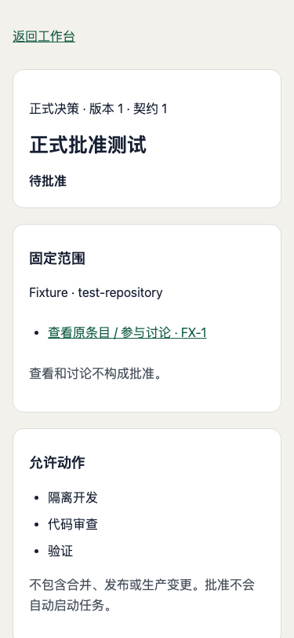
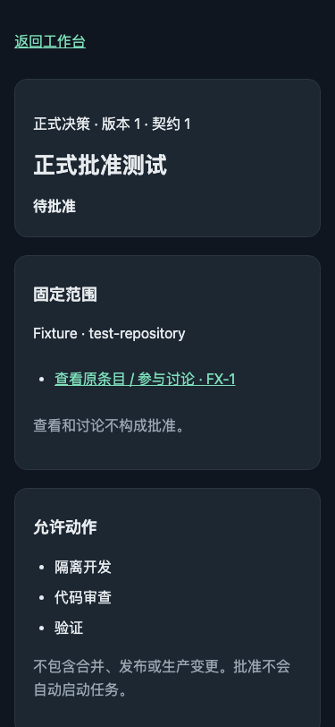
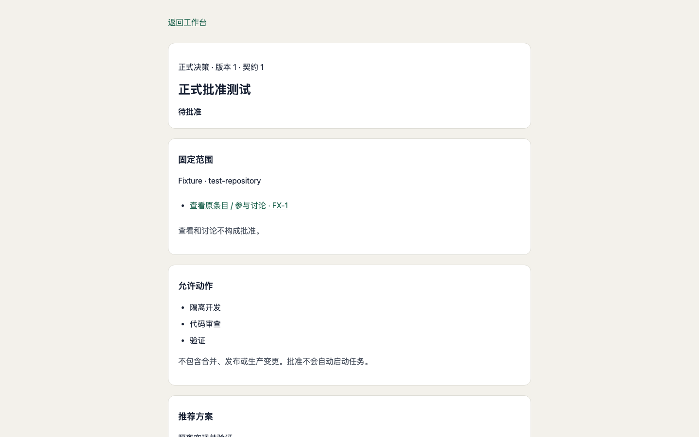
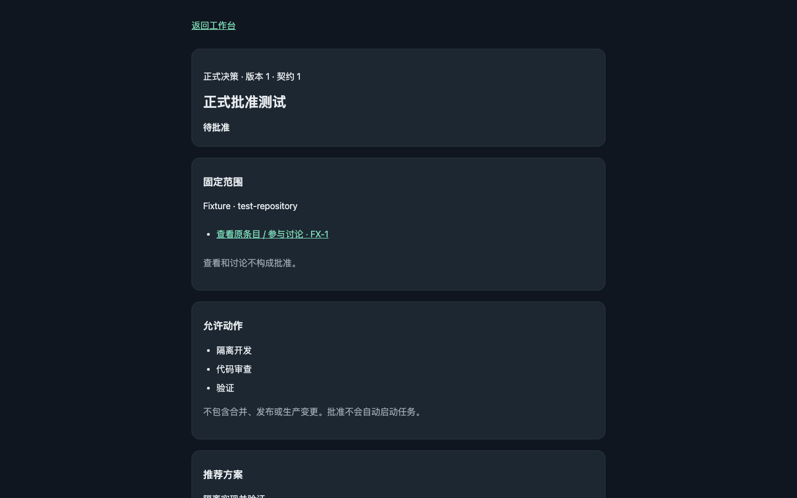

# AND-231 人工批准门禁：界面核验证据

日期：2026-09-27。来源：隔离临时数据库与本地 Chromium headless 实际页面截图。

应用代码基线：`3debea399908228fdc9edb0a6939760969df03b9`。本次证据提交仅添加图片与本说明，不改变应用代码。Fixture、FX-1 和 test-repository 均为测试内容，不是正式业务数据。

## 指定尺寸截图

以下图片像素尺寸与视口相同，deviceScaleFactor=1；没有裁剪、拼接、重绘或用设计图替代浏览器画面。

### 手机浅色 · 375×812

### 手机深色 · 375×812

### 桌面浅色 · 1440×900

### 桌面深色 · 1440×900

## 完整页面补充

指定视口首屏无法包含页面底部，因此另附同次捕获的整页图，以便检查确认框和批准按钮；整页图高度不等于视口高度。

- [手机浅色整页 · 375×1798](phone-light-full.png)
- [手机深色整页 · 375×1798](phone-dark-full.png)
- [桌面浅色整页 · 1440×1689](desktop-light-full.png)
- [桌面深色整页 · 1440×1689](desktop-dark-full.png)

## 实际检查与结果

- 四种视口／主题组合均完成渲染、字体就绪后捕获；水平溢出为 0。
- 文字尺寸与对比度通过现有 UI audit 规则，确认标签和刷新控件的触控尺寸通过检查。
- 每个组合的 pageerror 和 console.error 均为 0。
- 确认框均未勾选，批准按钮均为 disabled；仅查看页面没有批准。
- 截图后重新读取决策仍为 pending，审计只有 create，没有 approve 或 revoke 事件。
- 主代理直接查看整页图，未发现重叠、裁切或敏感信息；本提交不包含测试会话、数据库、凭据或运行日志。

## 边界

这是浏览器自动化与静态视觉检查，不是用户本人 Android 真机验收。未批准、未启动执行器、未合并、未发布或迁移生产。正式手机查看与点击验收仍应在获准发布后另行进行。
