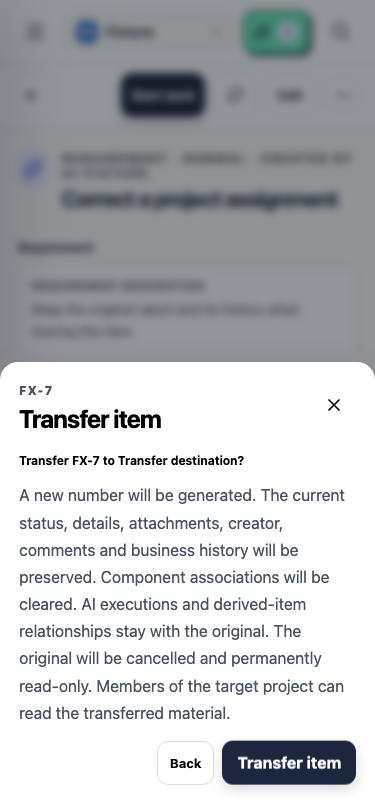
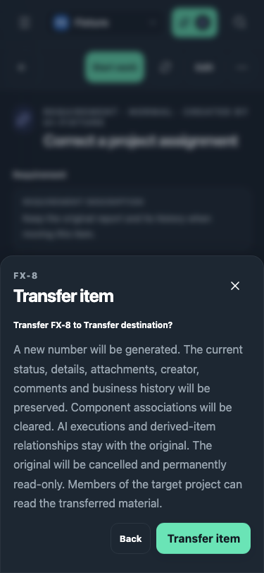
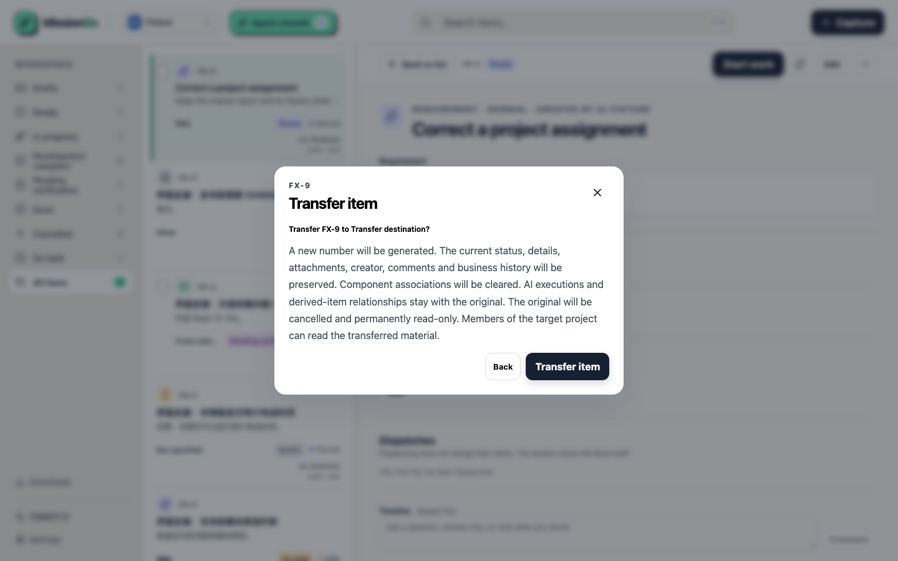
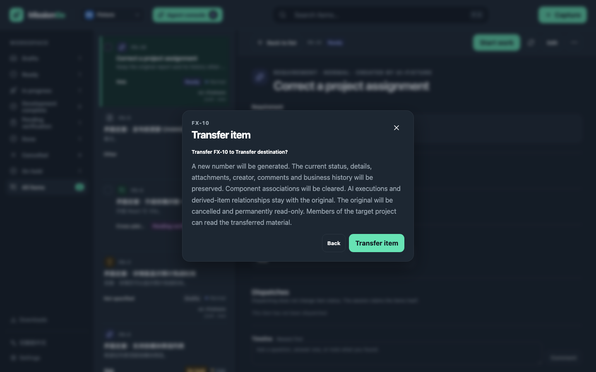

# AND-278 迁移确认界面

四张截图均来自临时数据库中的合成条目，没有使用真实条目、生产附件或账号资料。

- 手机：375 × 812，浅色与深色。
- 桌面：1440 × 900，浅色与深色。
- 生成与流程验证：`npx playwright test tests/ui/transfer.audit.spec.ts --project=audit`。
- 浏览器检查覆盖目标选择、二次确认、迁移跳转、历史保留、旧条目只读、横向溢出、字号、对比度及确认按钮触控尺寸。

